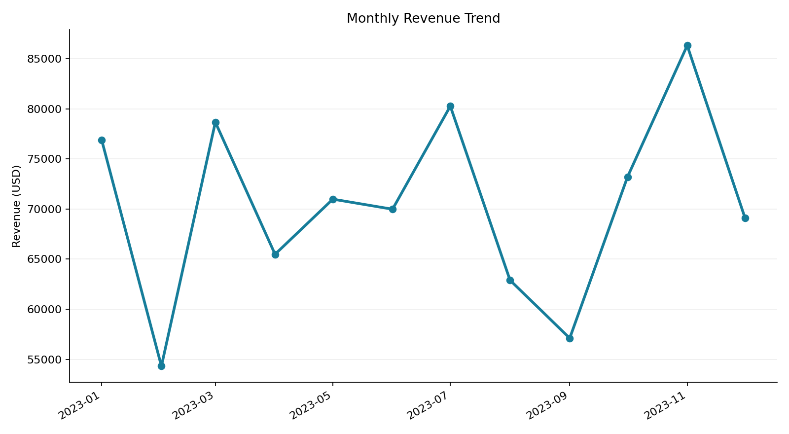
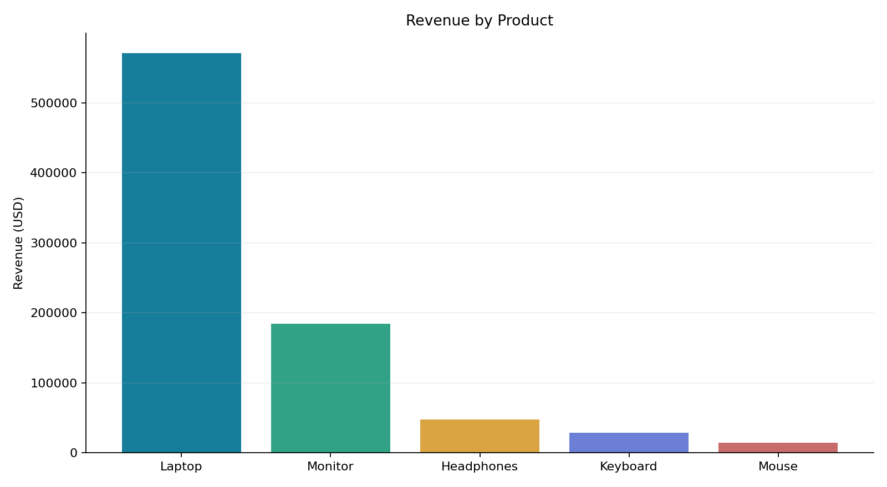
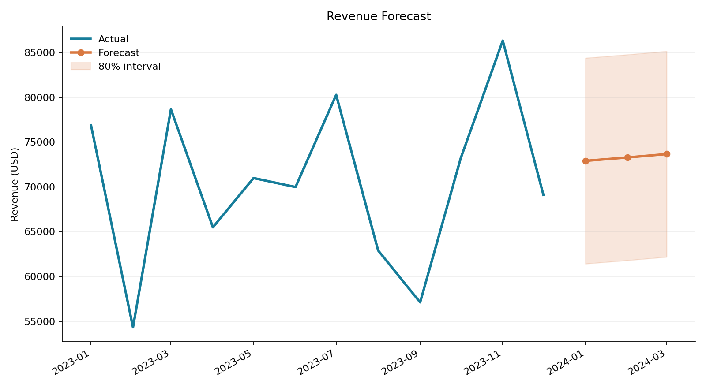

# Sales Performance Analytics

[](https://www.python.org/)
[](https://streamlit.io/)
[](https://github.com/RoninXDark/Sales-Analysis-AI/actions/workflows/tests.yml)

An end-to-end Python analytics project for turning transactional sales data into
business KPIs, interactive visualizations, anomaly flags, and a short-term
revenue forecast.

## Business Question

Managers need a quick way to understand revenue performance without rebuilding
the same Excel analysis every month. This project accepts a simple CSV export
and produces a dashboard plus reusable report files.

## Dashboard Capabilities

- Revenue, transaction count, average order value, and top-product KPIs
- Date and product filtering
- Monthly revenue and transaction trends
- Product contribution and revenue-share analysis
- Monthly anomaly detection using z-scores
- Linear revenue forecasting with an uncertainty interval
- Downloadable cleaned data and forecast results

## Report Preview







## Project Structure

```text
app.py                  Streamlit dashboard
main.py                 One-command sample report
sales_analytics/
|-- analysis.py         Cleaning, KPIs, anomalies, forecasting
`-- reporting.py        CSV, JSON, and chart generation
scripts/
`-- generate_report.py  Configurable CLI report command
data/
`-- sample_sales.csv    Reproducible synthetic dataset
reports/                Generated KPI tables and forecast output
tests/                  Analytics unit tests
```

## Input Format

The CSV requires three columns:

| Column | Meaning |
|---|---|
| `Date` | Transaction date |
| `Product` | Product or category name |
| `Revenue` | Non-negative transaction revenue |

## Run the Dashboard

```bash
git clone https://github.com/RoninXDark/Sales-Analysis-AI.git
cd Sales-Analysis-AI
python -m venv .venv
pip install -r requirements.txt
streamlit run app.py
```

## Generate Static Reports

```bash
python scripts/generate_report.py
```

Custom input:

```bash
python scripts/generate_report.py path/to/sales.csv --forecast-months 6
```

## Tests

```bash
pip install -r requirements-dev.txt
python -m pytest
```

## Model Note

The included forecast is a transparent linear baseline, not a production demand
forecast. Its R2 and RMSE are exposed so users can judge whether the trend is
useful. Seasonality, promotions, and external drivers would be the next step for
a production model.

## Tech Stack

Python, pandas, NumPy, Streamlit, Plotly, matplotlib, scikit-learn, pytest
